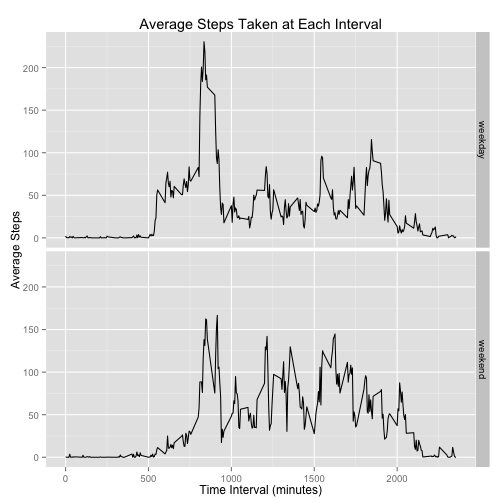

## Loading and preprocessing the data

The data has been unzipped and saved within the working directory. Here, the data is loaded into R and the structure of the data is examined.

```r
activity_data <- read.csv("activity.csv")
str(activity_data)
```

```
## 'data.frame':	17568 obs. of  3 variables:
##  $ steps   : int  NA NA NA NA NA NA NA NA NA NA ...
##  $ date    : Factor w/ 61 levels "2012-10-01","2012-10-02",..: 1 1 1 1 1 1 1 1 1 1 ...
##  $ interval: int  0 5 10 15 20 25 30 35 40 45 ...
```

Based on the structure output, it is clear that the 'date' column needs to be converted to date class.

```r
activity_data$date <- as.Date(activity_data$date)
str(activity_data)
```

```
## 'data.frame':	17568 obs. of  3 variables:
##  $ steps   : int  NA NA NA NA NA NA NA NA NA NA ...
##  $ date    : Date, format: "2012-10-01" "2012-10-01" ...
##  $ interval: int  0 5 10 15 20 25 30 35 40 45 ...
```
Now the date column is of the class date; and still formatted as YYYY-MM-DD.
 
## What is mean total number of steps taken per day?

To find the average total number of steps taken per day, the data is first grouped by day and then the sum of the steps taken each day is found. All missing (NA) values are ignored.

```r
library(dplyr)
```


```r
steps_per_day <- activity_data %>%
    group_by(date) %>%
    summarize(steps=sum(steps, na.rm=TRUE))
```

Here, a histogram of the total number of steps taken per day is produced.

```r
library(ggplot2)

ggplot(steps_per_day, aes(x=steps)) + geom_histogram(fill="steelblue", color="darkgrey", binwidth=600) + xlab("Steps") + ylab("Count") + ggtitle("Steps Taken Each Day From Oct. 1 to Nov. 30, 2012")
```

 

Below, are the mean and median of the total steps taken per day.

```r
mean(steps_per_day$steps, na.rm=TRUE)
```

```
## [1] 9354.23
```

```r
median(steps_per_day$steps, na.rm=TRUE)
```

```
## [1] 10395
```

The average of the total steps taken each day is 9354.23. The median of the total steps taken each day is 10395.
 
## What is the average daily activity pattern?

To find a daily average number of steps taken at each five-minute interval, the data is grouped by the interval and then the average number of steps at each interval is calculated.

```r
steps_per_int<- activity_data %>%
    group_by(interval) %>%
    summarize(steps=mean(steps, na.rm=TRUE))
```

The five-minute intervals (time) can be plotted with the corresponding average number of steps (averaged across each day of the two months).

```r
ggplot(steps_per_int, aes(interval, steps)) + geom_line(color="black") + xlab("Time Interval (minutes)") + ylab("Average Number of Steps") + ggtitle("Daily Average of Steps Taken Every 5 Minutes")
```

 

Here is the interval at which the daily average number of steps is greatest.

```r
which.max(steps_per_int$steps)
```

```
## [1] 104
```

This is the 104^th^ row of the data, which corresponds to the 835^th^ minute, at which the average number of steps was about 206.17.

```r
steps_per_int[104,]
```

```
## Source: local data frame [1 x 2]
## 
##   interval    steps
## 1      835 206.1698
```
 
## Imputing missing values

First, find out how many missing values are in the data set.

```r
sum(is.na(activity_data))
```

```
## [1] 2304
```

One way to account for the missing values in the data set would be to use an average value to fill them in. All of the missing values are in the 'steps' column.

```r
sum(is.na(activity_data$steps))
```

```
## [1] 2304
```

The average number of steps at each interval have aleady been calculated and can be used to replace the missing values of 'steps'. Here, the average value is used if the number of steps is missing. The new data set, without any NA values, is named 'complete_data'.

```r
fill_data <- function(data) {
    for (i in 1:nrow(data)) {
        if(is.na(data[i, 1])) {
            j <- match(data[i, 3], steps_per_int$interval)
            data[i, 1] <- steps_per_int[j, 2]
        }
    }
    return(data)
}   

complete_data<-fill_data(activity_data)
```

 Using the imputed mean values, the total number of steps taken each day is found, and a histogram is created. The data set containing the imputed values is named 'steps_per_day2'.

```r
 steps_per_day2 <- complete_data %>%
    group_by(date) %>%
    summarize(steps=sum(steps))
    
 ggplot(steps_per_day2, aes(x=steps)) + geom_histogram(fill="steelblue", color="darkgrey", binwidth=600) + xlab("Steps") + ylab("Count") + ggtitle("Steps Taken Each Day (With Imputed Values)")
```

 

The mean and median values of the total number of steps per day, with the imputed values, are as follows.

```r
 mean(steps_per_day2$steps)
```

```
## [1] 10766.19
```

```r
 median(steps_per_day$steps)
```

```
## [1] 10395
```
Recall, that without the imputed values the mean and median number of steps taken per day were  9354.23 and 10395, respectively. Here the mean number of steps has increased by 1411.96 to 10766.19. The difference of these two average numbers is about 15% of the average calculated without imputed values. The median number of steps remains the same.


```r
10766.19 - 9354.23
```

```
## [1] 1411.96
```

```r
(1411.96/9354.23)*100 
```

```
## [1] 15.09435
```

## Are there differences in activity patterns between weekdays and weekends?

To find the differneces in activity patterns between weekends and weekdays, a factor variable indicating whether each date is a weekday or weekend is created. This new factor variable is called 'day'. The new data set, previwed below, has the additional 'day' column and is named 'complete_data2'. Also, this new data set uses the previously imputed values in the 'steps' column.

```r
weekday <- c("Monday", "Tuesday", "Wednesday", "Thursday", "Friday")
 
complete_data2 <- mutate(complete_data, day=factor((weekdays(complete_data$date) %in% weekday), levels=c(TRUE, FALSE), labels=c("weekday", "weekend")))

head(complete_data2)
```

```
##       steps       date interval     day
## 1 1.7169811 2012-10-01        0 weekday
## 2 0.3396226 2012-10-01        5 weekday
## 3 0.1320755 2012-10-01       10 weekday
## 4 0.1509434 2012-10-01       15 weekday
## 5 0.0754717 2012-10-01       20 weekday
## 6 2.0943396 2012-10-01       25 weekday
```

Lastly, the data is grouped by interval and by the factor variable; then the average number of steps at each interval is calculated. The mean number of steps is plotted against the time interval in a multi-panel plot to see the activity patterns for weekdays versus weekends. 

```r
steps_per_day3 <- complete_data2 %>%
    group_by(interval, day) %>%
    summarize(steps=mean(steps))
    
ggplot(steps_per_day3, aes(interval, steps)) + geom_line() + facet_grid(day ~.) + xlab("Time Interval (minutes)") + ylab("Average Steps") + ggtitle("Average Steps Taken at Each Interval")
```

 
